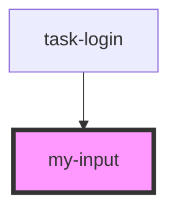

# my-input

<!-- Auto Generated Below -->

## Properties

| Property     | Attribute     | Description | Type     | Default |
| ------------ | ------------- | ----------- | -------- | ------- |
| `inputTitle` | `input-title` |             | `string` | `null`  |
| `inputType`  | `input-type`  |             | `string` | `null`  |

## Dependencies

### Used by

 - [task-login](../login)

### Graph

----------------------------------------------

*Built with [StencilJS](https://stenciljs.com/)*
